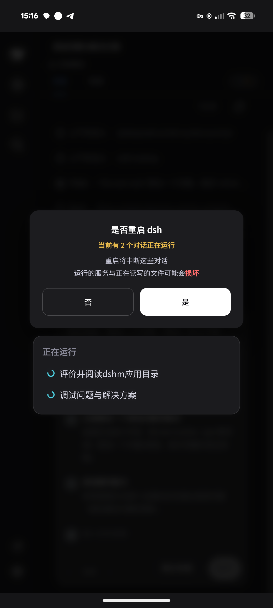
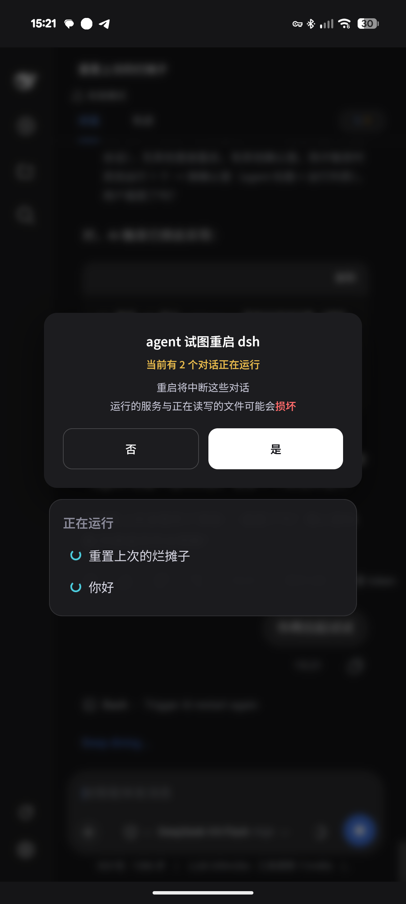
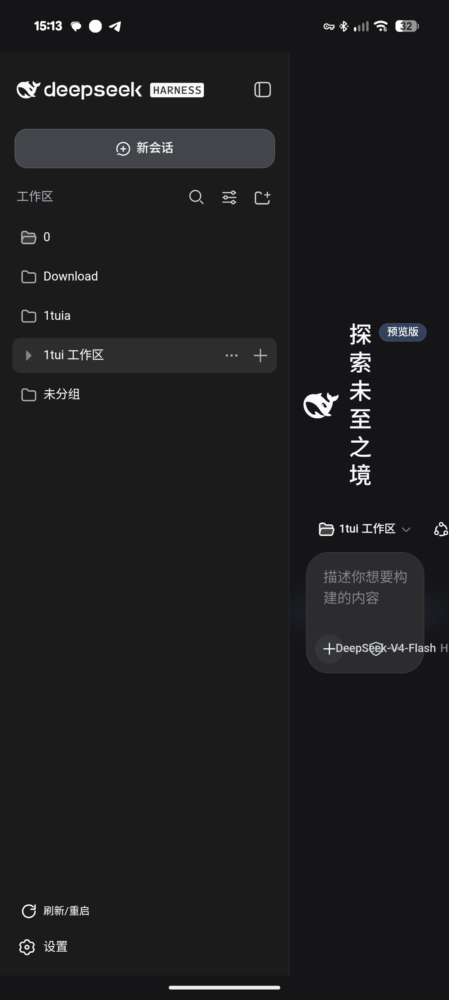

# dsh-AgentTask

dsh 任务监视 + 进阶重启插件。全端可用（APK / 手机浏览器 / PC）。

> Topic: [dsh-plugin](https://github.com/topics/dsh-plugin)

## 功能

### AgentTask 入口
主页顶部 tabs 行最右侧 **(x/y)** 胶囊：

| 值 | 颜色 | 语义 |
|---|---|---|
| x | 蓝 / 灰(0) | 运行中对话数 |
| y | 黄(有等待决策) / 绿 / 灰(0) | 等待决策 + 已完成未查看 |

点开面板：**运行中**（蓝矩阵）→ **等待决策**（黄，点击跳转不消除）→ **已完成**（绿，点击跳转消除 + ✕ 标记已读）。
数据与侧栏同源（`sessions.list`），打开会话两侧消点同步。

### 进阶重启按钮（sidebar.footer.action）
- 点击：重载前端；长按(移动端) / 右键(鼠标)：重启
- **无其他对话运行** → 直接重启（转圈+读秒+心跳）
- **有其他运行（含等待决策）** → 确认窗（标题按 agent/用户触发）→ ⚠ 黄色二次警告（上限 5）→ 确认重启
- 文案"刷新/重启"仅侧栏展开时显示

### 与 dshm-ui 共存
都安装时 AgentTask 接管（隐藏 dshm-ui 普通版按钮）；只装 dshm-ui 用普通版。

## 截图

| 截图 | 说明 |
|---|---|
|  | AgentTask 主页顶部入口 |
|  | 顶部 (x/y) 计数胶囊 |
|  | 用户长按重启：无运行时的简洁确认 |
|  | 用户长按重启：有运行/等待决策时的警告 |
|  | AI 请求重启时的确认弹窗 |
|  | 侧栏底部“刷新/重启”按钮 |

## 安装

### 标准安装（Profile Bundle，推荐）

```sh
# web profile
dsh plugin --profile web add github:knGear/dsh-AgentTask

# headless profile（dsh run 默认使用）
dsh plugin --profile headless add github:knGear/dsh-AgentTask
```

装完重启 `dsh --profile web` 生效；包内 `cordis.patch.yml` 会自动把插件加入 profile layer stack。

### 增强安装（Termux 一键，含 skill + 重启脚本）

```bash
# 已有 dsh 环境 (Termux)
bash <(curl -fsSL https://raw.githubusercontent.com/knGear/dsh-agenttask/main/scripts/install-agenttask.sh)

# 本地/开发
bash scripts/install-agenttask.sh /path/to/agenttask

# 卸载
bash <(curl -fsSL https://raw.githubusercontent.com/knGear/dsh-agenttask/main/scripts/uninstall-agenttask.sh)
```

> 手动安装与旧版本兼容：增强脚本把插件包复制进 `~/.dsh/profiles/node_modules/dsh-agenttask/` 并挂载同款 patch，效果与标准安装一致，额外部署 SKILL 与 `dsh-web-restart` 重启脚本（Termux）。

装完重启 dsh web 生效。

## 结构

```
agenttask/        插件包(index.js host + client.js + package.json + SKILL.md + cordis.patch.yml + dsh.plugin.json + index.d.ts)
scripts/          install-agenttask.sh / uninstall-agenttask.sh
```

## 端点

| 端点 | 用途 |
|---|---|
| `/api/dshat-reload-sse` | SSE 通道（reload / JSON restart 帧带 reqId + sessionId） |
| `/api/dshat-restart-confirm` | 前端回传 allow/deny（AI 请求的确认结果） |
| `/api/dshat-restart-go` | 用户主动重启的实际执行（确认后调用） |
| `/api/dshat-agents` | AgentTask 数据（运行中计数 + 会话） |

## 铁律：restart ≈ 截断
重启杀 host、中断所有对话，不可逆。AI 只能在当前会话最终步骤触发 `dshat_restart`，触发前必须阅读 `agenttask/SKILL.md` 中的铁律；调用后即截断，不得再等待/继续任何后续动作。逻辑已分级（无其他直接 / 有其他确认）。重启只能走 `dshat_restart` 工具，不要用 shell 直接执行 `dsh-web-restart` 或 kill 进程。
